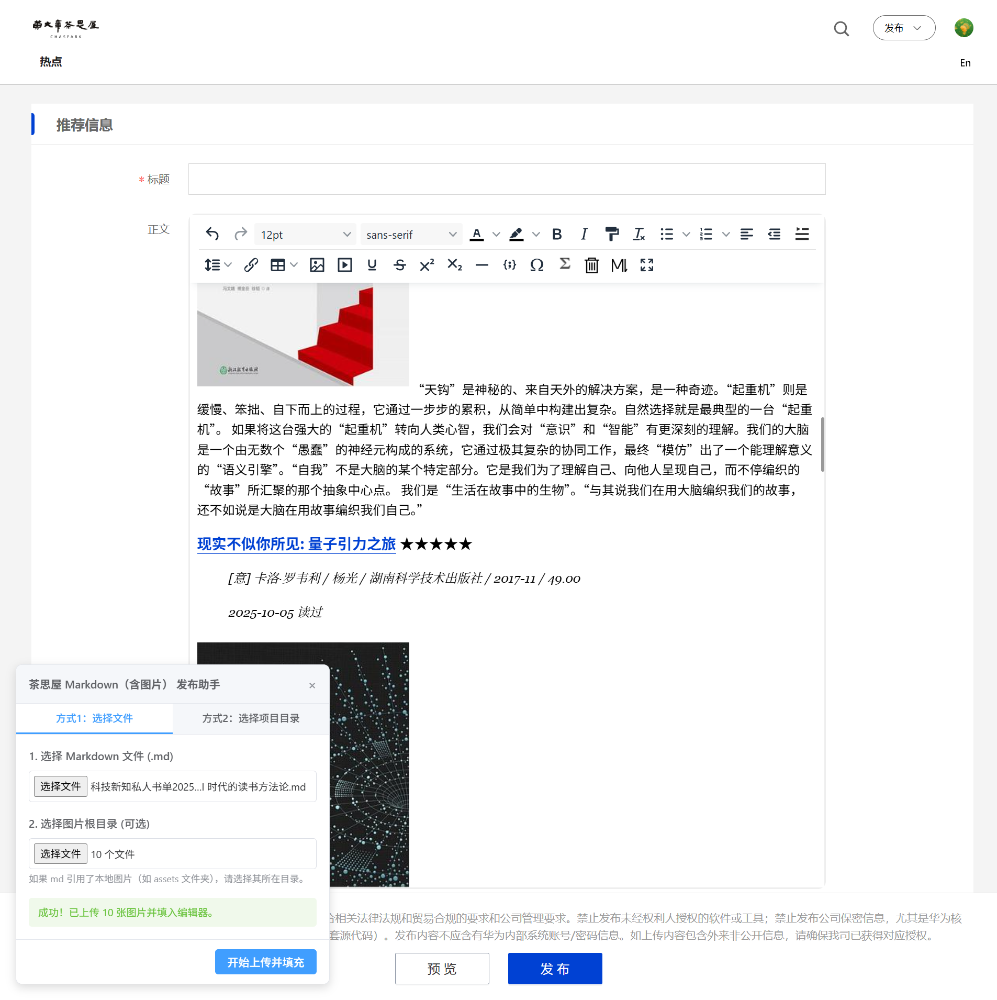

# 非官方-茶思屋 Markdown 发布助手 (Chaspark Markdown Publisher)

**茶思屋 Markdown 发布助手** 是一款专为 [黄大年茶思屋 (Chaspark)](https://www.chaspark.com) 设计的浏览器扩展，旨在通过自动化流程简化包含多图片的 Markdown 内容的发布操作。

---

## 🔥 核心特性

- 🖼️ **自动化上传图片**：自动解析 Markdown 中的本地相对路径图片，一键上传至茶思屋图床并自动替换链接。
- 📝 **智能解析器**：支持 Markdown 语法（标题、加粗、链接、引用、图片等）并转换为编辑器的原生产生内容。
- 📂 **双导入方案**：
  - **文件模式**：选择单个 `.md` 文件及配套图片目录。
  - **项目模式**：选择Markdown文件和图片所在文件夹，插件自动识别文档及资源，实现“一键发布”。
- 🛡️ **隐私安全**：所有操作均在本地浏览器内完成，不采集任何个人数据。

---

## 🛠️ 安装指南

1. **下载源码**：将本项目文件夹下载/克隆到本地。
2. **加载扩展程序**：
   - 打开 Chrome/Edge 浏览器，输入 `chrome://extensions/` 进入扩展管理页面。
   - 勾选右上角的 **「开发者模式」**。
   - 点击 **「加载已解压的扩展程序」**，选择本项目文件夹。
3. **固定至工具栏（建议）**：点击浏览器拼图图标 🧩，找到本插件并点击固定图标 📌。

---

## 📖 使用说明

### 1. 环境准备
- 确保您已在浏览器中登录 [黄大年茶思屋网站](https://www.chaspark.com)。
- 建议将 Markdown 引用图片的路径设置为**相对路径**（如 ``）。

### 2. 使用流程
1. **进入发布页**：手工操作进入黄大年茶思屋网站“学术热点”发布页面，或者在该网站其他页面点击插件图标，会引导您进入发布页面。
2. **导入内容**（本项目 example_doc 目录下包含一个多图片 Markdown 示例文件，可供测试）：
   - **方式 1**：选择您的 Markdown 文件，以及选择图片所在的根目录。
   - **方式 2**：直接选择 Markdown 文件所在项目文件夹（适合该目录仅包含唯一 Markdown 文件且相关图片也包含在此目录下的情况）。
3. **完成填充**：点击 **「开始上传并填充」**，插件将执行自动化操作：
   - 提取并上传本地图片到官方 CDN。
   - 替换所有图片引用为最新的网络地址。
   - 将渲染后的 HTML 自动注入发布页面编辑器。

---

## 🔒 隐私与许可

- **非官方插件**：目前黄大年茶思屋网站并未提供公开的内容发布 API 接口，本插件开发完全属于个人行为，旨在提高包含多图片的Markdown内容在网站的发布效率。相关行为若违反官方使用规范，本插件项目将下线处理。
- **隐私安全**：所有操作均在本地浏览器内完成，不采集任何个人数据。但本插件并未上架Chrome / Edge 官方扩展商店，安装使用须浏览器打开“开发者模式”，有一定安全风险，请自行斟酌是否使用，自行承担风险。
- **项目许可**：本项目基于 MIT 协议，欢迎二次开发与贡献。
