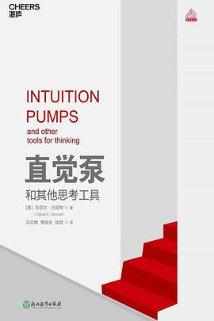
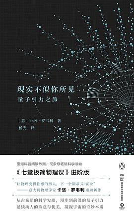

# 科技新知私人书单2025——探讨 AI 时代的读书方法论

## 楔子：读书的执念

我大概算是典型的“小镇做题家”，从一个偏远的小山村经历中考、高考、大学，毕业后进入城市工作，去海外常驻过几年，最后在深圳扎根。在我年少记忆里，书籍一直是匮乏的，即便到上了县重点中学之后，老师只管考试成绩，对课外书抓得格外严格，连报纸杂志、文学名著都只能偷偷阅读。

所以我的读书习惯一直是拣到什么书就读什么书，就算中途觉得“不好看”，也要坚持把它翻到最后一页。我把“读完”当成一种隐秘的道德标准：一本书如果没有被完整的阅读，就好像我对它、也对自己有所亏欠。那种感觉并不完全来自求知本身，更像是一种被多年训导出来的自律幻觉——仿佛只要坐得够久、看得够多，理解就会自然发生。

但这种信念在 AI 成为日常工具之后，开始慢慢瓦解。

## 当答案不再值得珍藏——探讨 AI 时代的读书方法论

AI 时代，知识速生速朽。我一次次的发现，那些曾经花费大量时间记住的内容，要么已经过时了，要么只需要一句提示就能被迅速调取。我也越来越频繁的意识到，真正卡住的从来不是“我不知道答案”，而是“我不知道该问什么”。

于是，一个问题开始逼近：如果答案已经不再稀缺，读书这件事还剩下什么意义？

从更长的时间尺度看，人类其实一直在把认知能力往外迁移。纸笔出现之后，记忆不再是唯一的存储介质；计算机普及之后，计算能力迅速贬值；搜索引擎和互联网，让事实性知识垂手可得。而现在，大模型开始接管总结、归纳、解释这些原本被认为属于人类理解范畴的工作。

某种意义上，这让经验重新变得值钱。那些在推崇“记得快、背得牢”时代被低估的东西——判断、直觉、敏感——开始重新浮现。这些都不是靠多读几遍书解决的。如果说过去的阅读，更像是在给大脑囤积物资，那么现在需要的阅读方式，更像是在不断清空仓库，只留下那些可以引导出答案的关键问题。

问题，比答案更难。一个答案，往往只是对既有问题的填充；而一个真正有价值的问题，意味着你已经隐约触达了现有解释的边界。那些在阅读中反复出现、却迟迟无法被解决的困惑，某种程度上是在进行开创新路的心理准备。

这也是为什么我越来越不信任那种“看完这本书你就懂了”的承诺。不是因为书不好，而是因为这个承诺背后，默认了一个已经过时的前提：只要信息足够完整，理解就会自动发生。但现实恰恰相反。今天，答案几乎可以廉价到即时获取，真正稀缺的是能够判断“哪些问题值得问”的能力。AI 可以在你提出问题之后，迅速生成一整套逻辑自洽的回答，但它很少替你问出开创视角的新问题。

而读书，如果还有什么不可替代的价值，可能恰恰就在这里。它不是为了让你更快的得到答案，而是为了不断制造一种不安：你意识到自己原本以为牢固的理解，其实并没有那么稳固。

这种转变，也直接改变了我对“读什么”的看法。不同类型的书正在被重新排序，一些书并没有变差，但它们显得不那么值得被精读，而另一些书却变得更重要了。

一旦一本书试图过早的让你感到安心，它往往也过早的结束了思考。那些高度操作性的、教程式的、清单化的方法论书籍，正在迅速失去它们原本的优势。不是因为它们没有价值，而是因为它们解决的问题，已经更适合通过即时向 AI 提问来解决。这类书当然仍然可以读，但阅读方式已经发生了变化，点读、跳读、检索式阅读，是一种更加合理分配注意力资源的方式。

真正值得慢下来读的，往往是另一类书。它们不急着给你结论，甚至常常让人感到无用：思想史、学科史、观念史，展示的问题如何出现、如何解决，又如何被新问题覆盖；哲学、社会学、人类学，本身就建立在分歧之上；那些带有强烈个人经验的写作，价值正来自其不可复制的人生经历。

对我而言，新的读书方式最终体现在一个看似微小的转变上：我开始允许自己不读完。在很长一段时间里，这几乎是一种禁忌。不读完，意味着半途而废，意味着不够认真。但现在我越来越清楚，在一个可以随时获得结构化摘要、DeepResearch 报告的时代，读书已经不再承担获取信息的任务，那是机器更擅长的事情。

人更适合做的，是在某些地方停下来。真正重要的不是你读了多少，而是你在哪些地方停住了。在这些停顿里，你开始意识到，理解不是线性的积累，而更像是在不断撞墙、后退、再换一个角度靠近。在这个过程中，AI 成了一个亲密的陪读者，我会让它帮我拆解晦涩的段落，让它从相反立场反驳作者，让它把某个观点从一个领域迁移到另一个领域。

在这种意义上，读书重新回到了一个朴素的位置。读书不再主要承担“打地基”的功能，而更像是在不断提供隐喻、拓展视角、训练问题迁移能力。最好的阅读状态往往是你读到一半，意识到必须停下来去做点什么，或者重新审视你正在做的事情。

AI 不会终结读书，但它会终结一些关于读书的幻觉。当答案唾手可得，读书反而变得更残酷——因为你再也不能把“我不知道”简单的归咎于信息不足。但它也因此变得更自由。当你不再为了囤积答案而阅读，读书才真正回到它原本的样子—— 一种与世界、与历史、也与自己持续对话的方式。

真正留下来的，不是你记住了多少内容，而是那些迟迟无法被回答、却不断逼迫你继续思考的问题。当答案不再值得珍藏，问题本身，开始成为读书的回报。

‍

## 我的私人书单——科技新知榜 2021\~2025

以下是我从近年阅读记录中挑出的 10 本书。因为是私人书单，所以下述书籍的选择、评论评分仅代表个人的阅读感受。书和人也是看缘分的，不同的人、在不同的时候、不同的场合阅读同一本书，感受都会不一样。

虽然说是科技新知榜，列的却都是多年前出版的旧书，一方面是因为我近年读书量不大，另一方面我也认定这些旧书包含的思想提出了很多新问题，足够我花费多年学习消化。你也不妨读读，再谈谈你的看法。

### [直觉泵和其他思考工具](https://book.douban.com/subject/30340107/) ★★★

> [美] 丹尼尔·丹尼特 / 冯文婧、傅金岳、徐韬 / 浙江教育出版社 / 2018-11-1 / 129.90 元
> 2025-10-26 读过

“天钩”是神秘的、来自天外的解决方案，是一种奇迹。“起重机”则是缓慢、笨拙、自下而上的过程，它通过一步步的累积，从简单中构建出复杂。自然选择就是最典型的一台“起重机”。

如果将这台强大的“起重机”转向人类心智，我们会对“意识”和“智能”有更深刻的理解。我们的大脑是一个由无数个“愚蠢”的神经元构成的系统，它通过极其复杂的协同工作，最终“模仿”出了一个能理解意义的“语义引擎”。“自我”不是大脑的某个特定部分。它是我们为了理解自己、向他人呈现自己，而不停编织的“故事”所汇聚的那个抽象中心点。

我们是“生活在故事中的生物”。“与其说我们在用大脑编织我们的故事，还不如说是大脑在用故事编织我们自己。”

‍

### [现实不似你所见: 量子引力之旅](https://book.douban.com/subject/27156306/) ★★★★★

> [意] 卡洛·罗韦利 / 杨光 / 湖南科学技术出版社 / 2017-11 / 49.00
> 2025-10-05 读过

《现实不似你所见》带给我们的，远不止是对前沿物理知识的惊叹。它更像是一场深刻的哲学洗礼，迫使我们反思自身感官与直觉的局限性。我们所见的坚实物体，是流动的事件；我们所体验的线性时间，是统计的幻象；我们所处的独立空间，是关联的网络。世界不是由“物体”构成的，而是由“相互作用”构成的。从现代物理学的山巅回望，我们来时的“现实”世界，已然变得面目全非。它不再是我们熟悉的那个坚实、确定的家园，而更像是一片由概率、关联和信息编织成的、在生灭流转中不断演化的奇妙织锦。

走出柏拉图的洞穴，双眼或许会因真理的强光而刺痛，内心或许会因常识的崩塌而迷惘。但这正是求知的代价，也是求知的奖赏。因为只有当我们承认“现实不似你所见”，才真正开启了通往更深层现实的大门。

‍

### [暗时间](https://book.douban.com/subject/6709809/) ★★★★

> 刘未鹏 / 电子工业出版社 / 2011-7 / 35.00 元
> 2025-07-27 读过

“鱼是最后一个看到水的”。我们每个人都生活在自己思维模式的“水”中，它如此天经地义，以至于我们从未觉察到它的存在。这些“水”，就是我们的先验假设、认知偏见。我们带着“有色眼镜”看待世界，对同样的信息，不同的人会做出截然不同的解读。我们倾向于将成功归因于自己，将失败归咎于外界；我们固执地寻找证据来支撑自己既有的信念，而对反面证据视而不见；我们在争论中捍卫的往往不是真理，而是那个不愿认错的“自我”。

或许，在读完《暗时间》之后，我们依然是那条在水中畅游的鱼。但不同的是，我们已经开始隐约感觉到“水”的存在。我们知道了边界，也就获得了超越边界的可能。

‍

### [无穷的开始: 世界进步的本源](https://book.douban.com/subject/26184242/) ★★★

> [英]戴维·多伊奇（David Deutsch） / 王艳红、张韵 / 人民邮电出版社 / 2014-11 / 59.00 元
> 2025-04-04 读过

作者在这本《无穷的开始》中探讨了知识创造、人类进步和宇宙本质的关系，提出了“无穷的开始”这一核心概念，认为通过不断寻求“好解释”——即那些难以改变、具有广泛延伸能力的解释性理论——人类能够创造新知识并实现无限的进步。

这是一种在真理探索路途上，对人类未来的乐观主义。

‍

### [走出唯一真理观](https://book.douban.com/subject/34988734/) ★★★★

> 陈嘉映 / 上海文艺出版社 / 2020-5 / 58
> 2024-12-30 读过

陈嘉映在书中反复强调，他的思想历程中一个关键的转变，是从“普遍主义”走向了对多元性的承认。他在书中引用海德格尔的观点：“永恒真理是基督教思想的残余。”并指出，哲学不应是一个封闭的体系，而应是不断开放的对话。"重要的问题不是找到唯一的道，而是这些不同的道之间怎样呼应，怎样交流，怎样斗争。"

书中还提出了一个耐人寻味的问题：“哲学是否已经终结？”传统哲学试图建立一个无所不包的唯一真理体系，这种追求在现代科学兴起后逐渐失去了意义。科学通过数学方法构建了高度精确的理论体系，而哲学的任务则转向了对意义的探讨。“哲学是对基本道理的贯通，但没有把世上所有道理统统贯通这回事，永远会有不同的体系。”在这个意义上，哲学的魅力不在于答案，而在于问题；不在于终结，而在于开拓。

‍

### [生命 3.0: 人工智能时代，人类的进化与重生](https://book.douban.com/subject/30262617/) ★★★

> [美] 迈克斯·泰格马克 / 汪婕舒 / 浙江教育出版社 / 2018-6 / 99.90 元
> 2024-10-02 读过

生命 1.0 是指那些硬件和软件都由进化决定的生物，比如细菌；生命 2.0 则是指硬件由进化决定，但软件可以通过学习和文化传承来改变的人类；而生命 3.0 则是指那些可以自行设计硬件和软件的智能体，即未来的人工智能。

英国数学家欧文·古德在 1965 年提出的“智能爆炸”理论认为，一旦我们创造出超越人类智能的机器，这些机器将能够设计出更智能的机器，从而引发一场智能的连锁反应，最终导致人类被远远甩在后面。这种情景既令人兴奋，又让人不安。一个重要的问题是：我们如何确保人工智能的目标与人类的目标一致？

‍

### [微积分的力量](https://book.douban.com/subject/35292688/) ★★★★

> 【美】史蒂夫·斯托加茨（Steven Strogatz） / 任烨 / 中信出版集团 / 2021-1 / 69.00 元
> 2024-06-23 读过

斯托加茨在书中写道：“对我来说，最大的谜题是：为什么宇宙是可理解的，以及为什么微积分会与其步调一致？”他在介绍微积分发展历史的同时，将抽象的数学概念与现实生活紧密结合，并通过大量的实际案例展示了微积分在现代科技中的核心作用。其中，对于艾滋病的研究和 CT 脑成像仪的发明令我印象深刻。

微积分不仅仅是一组公式和定理，更是一种思维方式，一种观测和解析世界的方法。通过它，我们可以用数学的眼光看待万物，从时间与空间的本质到运动与变化的规律。如果我在中学时期就能够读到这样的科普书籍，意识到数学这门基础学科的应用价值，我对数学的看法会有所不同。也许学习过程依然艰难，但我不会那么深恶痛绝。

‍

### [AI 3.0](https://book.douban.com/subject/35351678/) ★★★★★

> [美] 梅拉妮·米歇尔 / 王飞跃、李玉珂、王晓、张慧 / 四川科学技术出版社·湛庐 / 2021-2 / 99.90 元
> 2024-01-20 读过

这本书里从来没有提出过所谓的 AI 3.0，大概是中文出版者造的营销概念。英文书名是《Artificial Intelligence: A Guide for Thinking Humans》，有两种理解：一种是“人工智能：重新思考人类的指南”，另一种是“人工智能：一份面向思考人群的指南”。前者对应于书中多次指出的观点：“看似容易的事情其实很难”，后者则体现了强调了本书的目标受众——思考的人类——旨在向读者提供一个全面而易懂的人工智能发展概貌，这正是本书的主要内容。

英文原版封面采用了著名雕塑“思想者”形象，所以对书名的第二种理解应该是正解。"Thinking Humans" 强调了人类作为思考者和决策者的角色，暗示着人工智能应该作为一种工具去帮助人类思考和解决问题，而不是取代人类思考的能力。

‍

### [人类的荣耀: 是什么让我们独一无二](https://book.douban.com/subject/26862325/) ★★★★

> [美] 迈克尔·加扎尼加（Michael S. Gazzaniga / 彭雅伦 / 北京联合出版公司 / 2016-8 / 89.90 元
> 2022-12-31 读过

莎士比亚曾借哈姆雷特之口赞美人类：“人类是一件多么了不得的杰作！多么高贵的理性！多么伟大的力量！多么优美的仪表！多么文雅的举动！在行动上多么像一个天使！在智慧上多么像一个天神！宇宙的精华！万物的灵长！”

相比这些感性的赞美，这本书通过详实的科学研究成果来说明人类的独特之处，包括大脑结构和神经系统知识、众多动物心理学实验、精神病人案例，并且尝试从进化论的角度来探究这些人类特质从何发展而来。

‍

### [奇点临近: 当计算机智能超越人类](https://book.douban.com/subject/6855803/) ★★★★

> 董振华、李庆成 / 机械工业出版社 / 2011-10 / 69.00 元
> 2021-10-26 读过

这是一本描述未来的书，信息量很大。因为知识点密集，读起来会有点累。但不时迸现的思想火花，经常让你的大脑沸腾一会。

作者所谈论的奇点，是指人类和机器的融合。在不久的未来，人类积攒的知识和技能可以被机器快速的学习复制，机器智能将能脱离人类的协助实现自我演进，并将人类远远抛在后面，“第一台超智能机器将是人类最后一个发明。”

其后人类的命运将取决于机器的抉择，对人为善的机器也许会继续选择成为人类的助手，人类生命则可以借助机器实现永恒；对人为恶的机器则可以把人像动物一样圈养起来，通过纳米机器人直接接管人脑的神经系统，在人脑内创造幻象，就像黑客帝国一样。

也许，我们应该让机器学会人类最复杂的设计——情感。这样，机器人将会继承我们的价值观，在思想上变得跟我们的子孙无异，不虞有被背叛的风险。

‍
